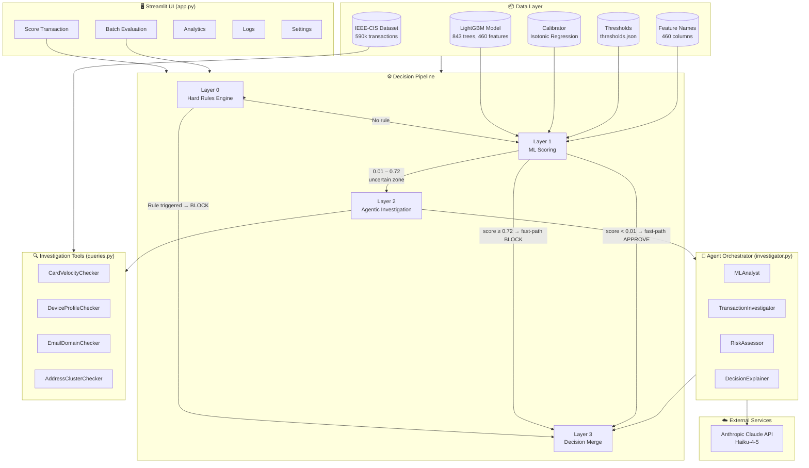
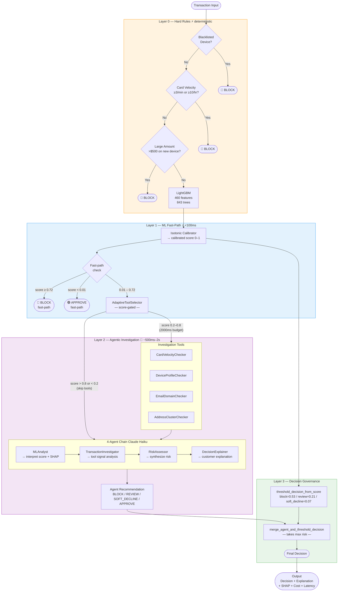
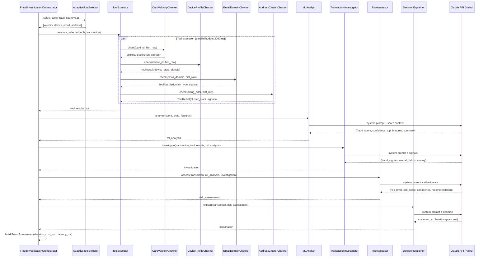
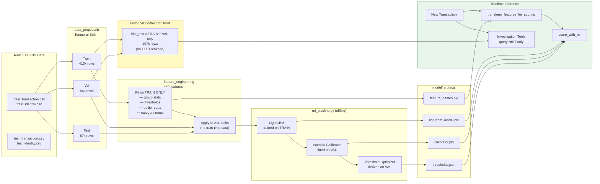
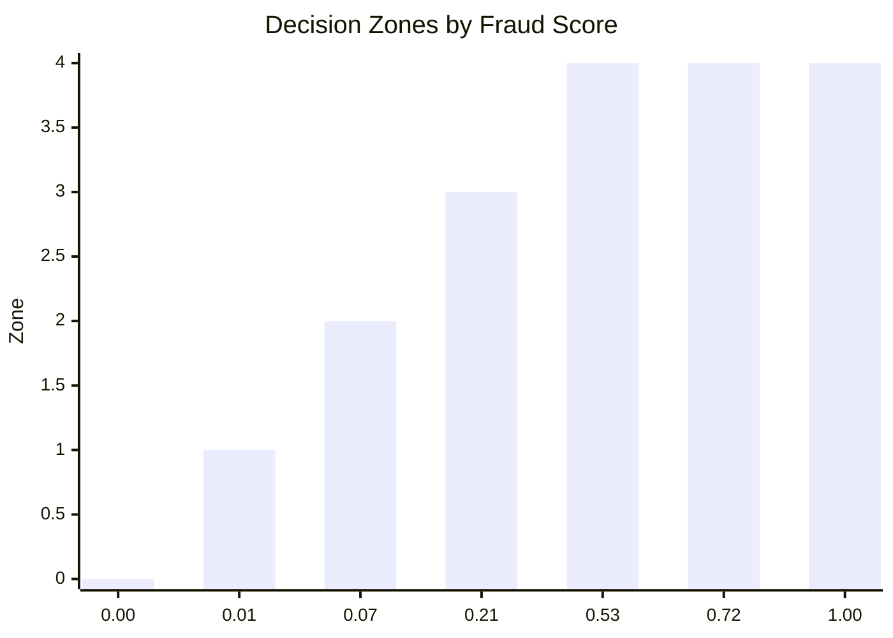

 # Fraud Investigation Engine — Architecture Diagrams

> **Miro import tip:** In Miro, add a new frame → Insert → Mermaid diagram → paste any block below.

---

## 1. System Overview



---

## 2. Layered Decision Flow



---

## 3. Agent Pipeline Detail



---

## 4. Data Flow & Leakage Boundaries



---

## 5. Component Dependency Map

```mermaid
graph TD
    APP[app.py\nStreamlit UI]

    subgraph HELPERS
        LDR[helpers/loaders.py]
        BST[helpers/decision_strategy.py]
        RUL[helpers/rules_engine.py]
        BAT[helpers/batch_runner.py]
        SHP[helpers/feature_attribution.py]
    end

    subgraph AGENTS_MOD
        INV[agents/investigator.py\nOrchestrator + 4 Agents]
        TEX[agents/tool_execution.py]
        TSL[agents/tool_selection.py]
        DLG[agents/dialogue.py]
        LRN[agents/learning.py]
    end

    subgraph TOOLS_MOD
        QRY[tools/queries.py\n4 Investigation Tools]
    end

    subgraph SCRIPTS
        MLP[scripts/ml_pipeline.py\nscore_with_ml()]
        FEN[scripts/feature_engineering.py]
        FIA[scripts/fraud_investigation_agents.py]
    end

    subgraph CONFIG
        CFG[config.py]
        THR[model/thresholds.json]
    end

    APP --> LDR
    APP --> BST
    APP --> RUL
    APP --> BAT
    APP --> SHP
    APP --> FIA
    APP --> MLP
    APP --> CFG

    LDR --> MLP
    BAT --> MLP
    BAT --> INV
    FIA --> TSL
    FIA --> TEX
    FIA --> INV

    INV --> DLG
    INV --> LRN
    TEX --> QRY
    TSL --> QRY

    CFG --> THR
    MLP --> CFG
    INV --> CFG

    style APP fill:#bbdefb,stroke:#1976d2
    style HELPERS fill:#f3e5f5,stroke:#7b1fa2
    style AGENTS_MOD fill:#e8f5e9,stroke:#388e3c
    style TOOLS_MOD fill:#fff3e0,stroke:#f57c00
    style SCRIPTS fill:#fce4ec,stroke:#c62828
    style CONFIG fill:#eceff1,stroke:#546e7a
```

---

## 6. Threshold Decision Zones



| Score Range | Zone | Decision | Agent Invoked? |
|---|---|---|---|
| `< 0.01` | Fast-path Approve | 🟢 APPROVE | No |
| `0.01 – 0.07` | Low risk | 🟢 APPROVE | Yes (if in 0.01–0.72) |
| `0.07 – 0.21` | Elevated risk | 🟡 SOFT_DECLINE | Yes |
| `0.21 – 0.53` | Medium risk | 🟠 REVIEW | Yes |
| `0.53 – 0.72` | High risk | 🔴 BLOCK | Yes |
| `≥ 0.72` | Fast-path Block | 🔴 BLOCK | No |
